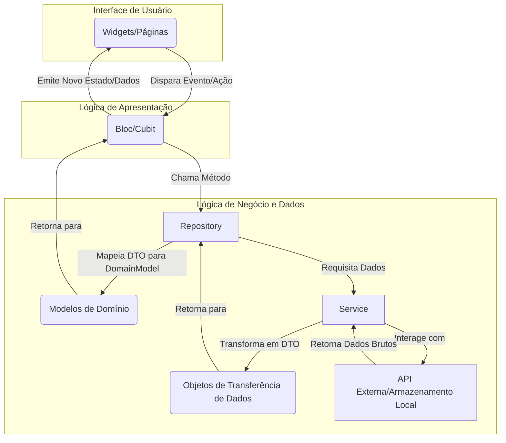

# Documentação do Projeto Movie Searcher

Este documento detalha o projeto Movie Searcher, com foco na sua arquitetura MVVM (Model-View-ViewModel) e na gestão de estados utilizando a biblioteca BLoC/Cubit, conforme amplamente adotado e recomendado no ecossistema Flutter. O objetivo é fornecer uma compreensão rápida e clara do código para programadores.

## 1. Visão Geral do Projeto

O projeto "Movie Searcher" é um aplicativo Flutter para pesquisar e exibir informações detalhadas sobre filmes. Ele foi projetado com uma **arquitetura modular e camadas bem definidas** para garantir facilidade de manutenção, testabilidade e escalabilidade.

## 2. Arquitetura MVVM (Model-View-ViewModel)

A arquitetura **MVVM é implementada para garantir uma separação clara de preocupações**, o que é crucial para projetos Flutter de médio a grande porte. No contexto deste projeto, a aplicação das camadas é a seguinte:

* **View (Interface do Usuário):**
  * Localizada principalmente na pasta `ui/movies/views`.
  * Consiste em todos os **widgets e páginas que o usuário vê e interage**.
  * Sua responsabilidade é puramente apresentar o estado e encaminhar as interações do usuário (eventos) para o ViewModel.
  * **Exemplos:** `detail_page.dart`, `recent_page.dart`, `search_page.dart`.

* **ViewModel (Lógica de Apresentação):**
  * Localizada na pasta `ui/movies/view_models`.
  * Neste projeto, os **`Cubit`s e `Bloc`s atuam como ViewModels**.
  * São responsáveis por expor dados para a View, processar eventos da View, interagir com a camada Model para obter ou manipular dados, e emitir novos estados que a View pode observar.

* **Model (Lógica de Negócio e Dados):**
  * Subdividida em **`domain` e `data`**.
  * **Domain Models (`domain/models`):** Contêm a **lógica de negócio pura e objetos de domínio** que são independentes de como os dados são obtidos ou apresentados. Exemplo: `movie.dart`.
  * **Data Layer (`data`):**
    * **Data Transfer Objects (DTOs) (`data/models`):** Representam a **estrutura dos dados como são recebidos de fontes externas** (ex: API). Exemplo: `movie_dto.dart`.
    * **Services (`data/services`):** Lidam com a **comunicação direta com fontes de dados** (APIs externas, armazenamento local). Exemplo: `dio_service.dart`, `movie_service.dart`, `local_store_service.dart`.
    * **Repositories (`data/repositories`):** Atuam como uma **camada de abstração sobre os serviços de dados**, transformando DTOs em Domain Models e vice-versa, e orquestrando o acesso aos dados. Exemplo: `movies_repository.dart`.

### Fluxo de Dados MVVM

## 3. Gestão de Estados com BLoC/Cubit

A biblioteca `flutter_bloc` é a escolha para **gestão de estados**, proporcionando uma arquitetura reativa e previsível. Os `Bloc`s e `Cubit`s são usados como os ViewModels do projeto, orquestrando as interações e atualizações da UI.

### 3.1. `ThemeCubit`

* **Função:** Responsável por **gerenciar e persistir o modo de tema** do aplicativo (claro, escuro ou sistema).
* **Estado:** Mantém o `ThemeMode` atual.
* **Ações:** Possui métodos como `load()` para carregar o tema salvo na inicialização e `toggle()` para alternar entre os modos de tema.
* **Persistência:** O `ThemeCubit` interage diretamente com `SharedPreferences` para salvar e carregar a preferência do usuário.
* **Uso:** É fornecido na raiz do aplicativo através de um `BlocProvider` em `di.dart`, tornando-o acessível globalmente. O widget `ThemeToggleAction` na `AppBar` utiliza este Cubit para a interação do usuário.

### 3.2. `SearchBloc`

* **Função:** Gerencia toda a **lógica relacionada à busca de filmes**.
* **Estados:** Define vários estados para representar o ciclo de vida da busca: `SearchIdle`, `SearchLoading`, `SearchSuccess`, `SearchEmpty`, `SearchError`. Cada estado carrega o `query` (termo de busca) associado.
* **Eventos:** Responde a eventos como `SearchTextChanged` (disparado ao digitar, com um debounce para otimização) e `SearchSubmitted` (disparado ao submeter a busca).
* **Dependência:** Utiliza o `MoviesRepository` para realizar as chamadas de busca à API de filmes.
* **Uso:** É disponibilizado via `BlocProvider` na `SearchPage` em `di.dart`. A `SearchBarArea` dispara eventos e a `ResultsSliver` consome os estados para exibir os resultados ou mensagens.

### 3.3. `DetailCubit`

* **Função:** Controla a **exibição dos detalhes de um filme específico**.
* **Estados:** Inclui `DetailLoading`, `DetailLoaded` (com o objeto `Movie`), e `DetailError`.
* **Ações:** O método `load(id)` busca os detalhes do filme pelo `imdbId` e, após o sucesso, registra o filme como recente.
* **Dependências:** Depende de `MoviesRepository` para obter os detalhes do filme e de `LocalStoreService` para salvar o filme visitado na lista de recentes.
* **Uso:** Criado e fornecido através de um `BlocProvider` especificamente para a `DetailPage` em `di.dart`. A `DetailPage` escuta seus estados para mostrar informações, progresso ou erros.

### 3.4. `RecentCubit`

* **Função:** Gerencia a **lista de filmes visitados recentemente**.
* **Estados:** Possui estados como `RecentLoading`, `RecentLoaded` (com a lista de filmes), `RecentEmpty`, e `RecentError`.
* **Ações:** Contém os métodos `load()` para carregar a lista do armazenamento local e `clear()` para remover todos os filmes recentes.
* **Dependência:** Interage com `LocalStoreService` para acessar os filmes salvos localmente.
* **Uso:** Fornecido via `BlocProvider` na `RecentPage` em `di.dart`. A `RecentPage` utiliza este Cubit para exibir a lista e permitir sua limpeza.

### 3.5. `SearchAdaptabilityBloc`

* **Função:** Responsável por **adaptar a UI da página de busca** com base na largura da tela, influenciando o layout da barra de busca e o número de colunas dos resultados.
* **Estado:** `SearchAdaptabilityState`, que encapsula o `barLayout` (layout da barra de busca) e o `columns` (número de colunas para o grid de resultados).
* **Eventos:** Reage ao evento `WidthChanged(width)`, que é disparado quando a largura da tela é alterada.
* **Uso:** Também fornecido via `BlocProvider` na `SearchPage` em `di.dart`. Seu estado é observado pela `SearchBarArea` para ajustar seu layout e pela `ResultsSliver` para definir o `crossAxisCount` do `GridView`.

## 4. Injeção de Dependências (`di.dart`)

O arquivo `di.dart` desempenha um papel central na configuração do aplicativo, **gerenciando a criação e a disponibilidade de serviços, repositórios e ViewModels (BLoC/Cubit)** para toda a árvore de widgets.

* A função `buildApp()` é o ponto de entrada para a **configuração das dependências**.
* **`MultiRepositoryProvider`:** É utilizado para fornecer instâncias de `MoviesRepository` e `LocalStoreService` para o contexto do widget tree, permitindo que outros `Bloc`s/`Cubit`s os acessem usando `context.read()`.
* **`BlocProvider`:** É empregado para instanciar e disponibilizar os `Cubit`s e `Bloc`s (como `ThemeCubit`, `SearchBloc`, `SearchAdaptabilityBloc`, `DetailCubit` e `RecentCubit`) nos escopos apropriados, garantindo que as Views possam observar seus estados.
